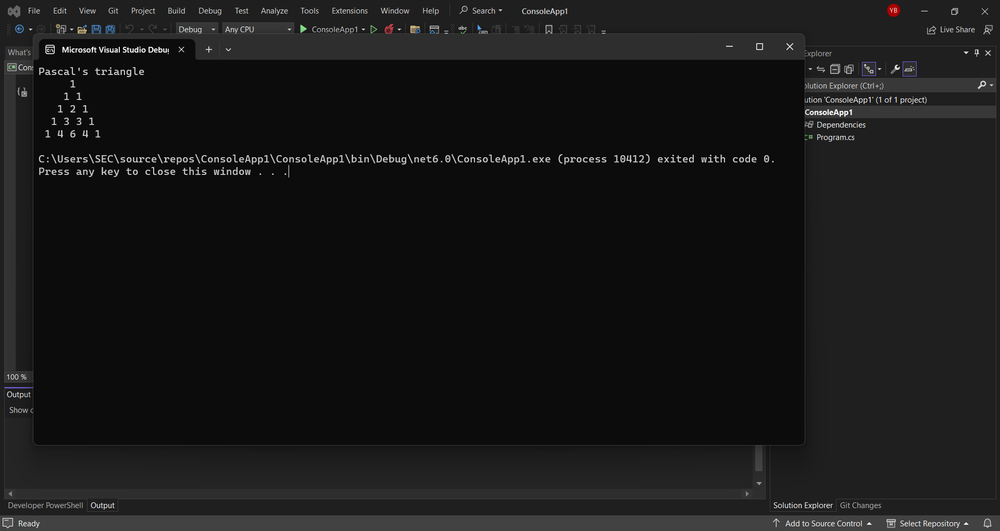

# Exp02-CSharpPattern

## Aim :

To write the C# program to print Pascal's triangle.

## Algorithm :

### Step1 :

Initialize the neccessary attributes.

### Step2 :

Get the no. of rows from the user.

### Step3 :

Using for loop print the rows, columns and spaces at required places.

### Step4 :

Apply if condition to print 1.

### Step5 :

If the condition fails, print the number using the formula. value=value*(i-j+1)/j.

## Program:

### DEVELOPED BY : YOGABHARATHI S
### REG NO : 212222230179
```
using System;
public class Pattern
 {

    public static void Main() 
    {
        int rows, c = 1, s, i, j; 
        rows=Convert.ToInt32(Console.ReadLine());
        Console.WriteLine("Pascal's triangle");
        for(i = 0; i<rows; i++) 
        {
            for(s = 1; s <= rows-i; s++)
            Console.Write(" ");
            for(j = 0; j <= i; j++)
            {
               if (j == 0||i == 0)
               c = 1;
               else
               c = c*(i-j+1)/j;
               Console.Write(c + " ");
            }
            Console.WriteLine();
        }
    }
   
}
```

## Output :


## Result :

Hence, a C# program for a pascal's triangle is executed successfully.